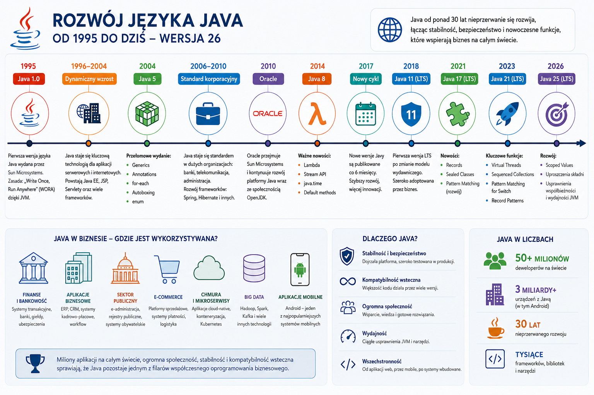
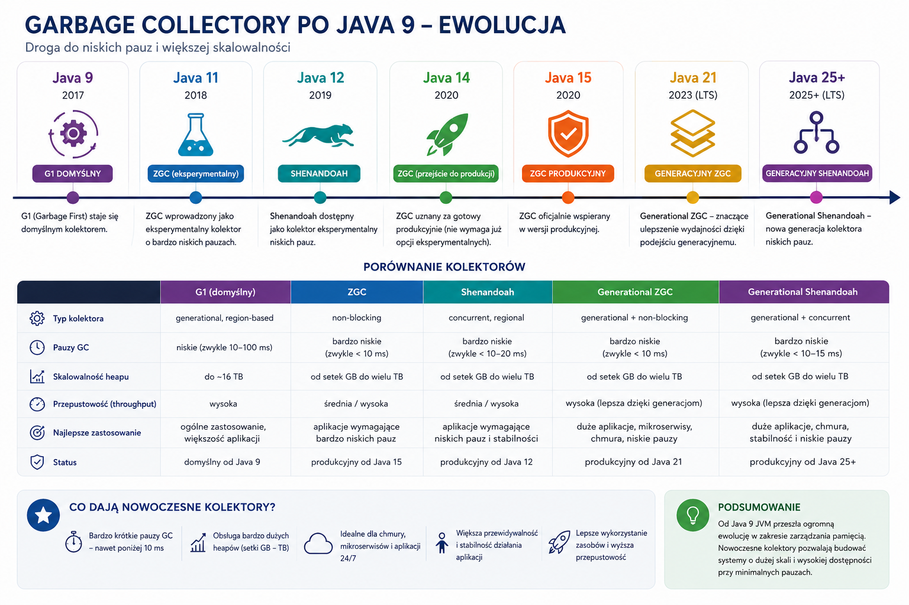

# Projekt Amber-doskonalenie i rozwój języka

## Wstęp

### Rozwój języka Java – najważniejsze etapy

* **1995 – Java 1.0**
  Firma Sun Microsystems publikuje pierwszą wersję języka Java. Głównym założeniem jest zasada *„Write Once, Run Anywhere”* (WORA) – możliwość uruchamiania tego samego kodu na różnych systemach operacyjnych dzięki maszynie wirtualnej JVM.

* **Lata 1996–2004 – dynamiczny wzrost popularności**
  Java staje się jednym z najważniejszych języków programowania dla aplikacji serwerowych, korporacyjnych i internetowych. Powstają technologie Java EE (Enterprise Edition), JSP, Servlety oraz pierwsze popularne frameworki biznesowe.

* **2004 – Java 5**
  Jedno z najważniejszych wydań w historii języka. Wprowadzono:

  * typy generyczne (*Generics*),
  * adnotacje (*Annotations*),
  * pętlę `for-each`,
  * automatyczne pakowanie typów (*Autoboxing*),
  * typ wyliczeniowy `enum`.

* **2006–2010 – Java jako standard korporacyjny**
  Java staje się dominującą technologią w bankowości, telekomunikacji, administracji publicznej i dużych systemach biznesowych. W tym okresie rozwijają się frameworki takie jak Spring Framework oraz Hibernate.

* **2010 – przejęcie Sun Microsystems przez Oracle**
  [Oracle](https://www.oracle.com?utm_source=chatgpt.com) przejmuje rozwój platformy Java, kontynuując jej rozwój wraz ze społecznością OpenJDK.

* **2014 – Java 8**
  Najbardziej przełomowe wydanie od czasu Javy 5:

  * wyrażenia lambda,
  * Stream API,
  * nowoczesne API dat i czasu (`java.time`),
  * interfejsy z metodami domyślnymi (`default methods`).

* **2017 – nowy cykl wydawniczy**
  Zamiast dużych wydań co kilka lat, Java przechodzi na regularny cykl publikacji nowych wersji co 6 miesięcy, co znacząco przyspiesza rozwój języka.

* **2018 – Java 11 (LTS)**
  Pierwsza długoterminowo wspierana wersja po zmianie modelu wydawniczego. Szeroko adoptowana przez przedsiębiorstwa.

* **2021 – Java 17 (LTS)**
  Wprowadzenie rekordów (*Records*), klas zapieczętowanych (*Sealed Classes*) oraz dalszego rozwoju Pattern Matchingu. Java staje się bardziej zwięzła i nowoczesna.

* **2023 – Java 21 (LTS)**
  Jedno z najważniejszych wydań ostatnich lat:

  * Virtual Threads (Project Loom),
  * Sequenced Collections,
  * Pattern Matching for Switch,
  * Record Patterns.

* **2025 – Java 25 (LTS)**
  Kolejna wersja długoterminowa. Rozwijane są m.in. Scoped Values, uproszczenia składni oraz kolejne usprawnienia współbieżności i wydajności JVM.

* **2026 – Java 26**
  Najnowsza wersja platformy. Kontynuuje rozwój nowoczesnych mechanizmów współbieżności, Pattern Matchingu, wydajności JVM oraz wsparcia dla nowoczesnych protokołów sieciowych (m.in. HTTP/3).

### Java dzisiaj

Po ponad 30 latach rozwoju Java pozostaje jednym z najważniejszych języków programowania na świecie. Jest wykorzystywana m.in. do budowy:

* systemów bankowych i finansowych,
* aplikacji biznesowych i ERP,
* systemów administracji publicznej,
* platform e-commerce,
* aplikacji chmurowych i mikroserwisów,
* systemów Big Data (np. Apache Hadoop),
* aplikacji mobilnych dla systemu Android.

Dzięki połączeniu stabilności, kompatybilności wstecznej oraz ciągłego rozwoju Java pozostaje jednym z filarów współczesnego oprogramowania biznesowego.

- Gdzie śledzić zmiany?: https://openjdk.org/projects/amber/



## Inferencja typów z użyciem `var` (ang. Local-Variable Type Inference `var`)

Inferencja typów – mechanizm w językach statycznie typowanych, w którym kompilator określa typ danych na podstawie
informacji dostępnych w czasie
kompilacji, np. typów zadeklarowanych wcześniej lub określania typów na podstawie wartości już znanych zmiennych.

Od java10:

```java
var list = new ArrayList<String>();  // infers ArrayList<String>
var stream = list.stream();          // infers Stream<String>
```

```java
List<String> names = new ArrayList<>();
// ^ developers complain about degree of boilerplate code
//var names = new ArrayList<>();
names.add("aa");
names.add("bb");
names.add("cc");
//names.add(2);
System.out.println(names);
```

Ograniczenia:

```java
//it won't work, it causes:  "cannot infer type for local variable x"
var x;
var x = null;
var x = {1, 2};
```

## Fabryka niemodyfikowalnych (ang. immutable) kolekcji

Przed java9:

```java
List<String> names = new ArrayList<>();
names.add("aa");
names.add("bb");
names.add("cc");

List<String> unmodifiableList = Collections.unmodifiableList(names);
unmodifiableList.add("zz");
```

Od java9 (przydatne dla kolekcji z małą, niemodyfikowalną liczbą elementów), działa dla `List`, `Set` oraz `Map`:

```java
List<String> newUmodificableList = List.of("aa", "bb", "cc");
newUmodificableList.add("zz");
```

## Niemutowalne kolekcje zwracane z użyciem `stream()`

```java
List<String> names = new ArrayList<>();
names.add("aa");
names.add("bb");
names.add("cc");

List<String> listFromStream = names.stream().collect(Collectors.toUnmodifiableList());
listFromStream.add("zzz");

//From java16
List<String> listFromStream_v2 = names.stream().toList();
```

## Rozwój `Optional`

Przed java10, należało użyć metody `isPresent`, bo inaczej narażalismy się na wyjątek `NoSuchElementException`
oraz ostrzeżenie (warning). Po dodaniu `orElseThrow`, "zapachy kodu" jest lepsze:

```java
void main() {

  Optional<String> result = getResult();

  result.ifPresent(s -> System.out.println("isPresent: " + s));

  result.ifPresentOrElse(
          s1 -> System.out.println("jest wartość: " + s1),
          () -> System.out.println("wyświetlam wartość zastępczą")
  );
  
}

Optional<String> getResult() {
  //return Optional.of("aaa");
  return Optional.empty();
}
```

## Uproszczenie API do operacji na plikach

Wczytywanie i zapisywanie plików (od java11):

```java
public static void main(String[] args) throws IOException {

    Path path = Files.createTempFile("myfile", ".txt");

    Files.writeString(path, "Some text to be saved");

    String string = Files.readString(path);

    System.out.println(string);
}
```

## Nowe metody dla klasy `String` (łancuch znaków)

```java
// repeat
String repeat = "ha".repeat(20);

// strip() vs trim()
String trimmed = " to be trimmed \t".trim();
String strip = " to be stripped \t \n".strip();
String stripLeading = " from leading".stripLeading();
String stripTrailing = "from tailing  ".stripTrailing();

// isBlank vs isEmpty
// The isBlank() method, introduced in Java 11, is identical to isEmpty() with the nuance 
// that it also returns true for Strings that contain only whitespace characters.
boolean empty = "".isEmpty();
boolean blank = "".isBlank();
boolean blank1 = "  ".isBlank();
boolean blank2 = "\t\n\r\f ".isBlank();

// intent (java12)
String indent15 = "indent\nplease".indent(15);

// lines (java11)
List<String> list = ("ttt \r www \n qwqq \t bbb").lines().toList();

// transform (java12)
List<String> transformed = "Ola\nKasia\nZosia".transform(e -> e.lines().toList());

// splitWithDelimiters (java21)
String[] splitWithDelimiters = "Long::brown::curly::hair".splitWithDelimiters("::", 3);
```

### Emoji

```java
String welcomeMsg = "Hey Java Developers! 🙋🏻‍♂️";
```

## Bloki tekstowe

Reprezentacja jsona/sql/xml itp

```json
{
  "menu": {
    "id": "file",
    "value": "File",
    "popup": {
      "menuitem": [
        {
          "value": "New",
          "onclick": "CreateNewDoc()"
        },
        {
          "value": "Open",
          "onclick": "OpenDoc()"
        },
        {
          "value": "Close",
          "onclick": "CloseDoc()"
        }
      ]
    }
  }
}
```

Przed java15:

```java
String mrJson = "{\"menu\": {\n" +
        "  \"id\": \"file\",\n" +
        "  \"value\": \"File\",\n" +
        "  \"popup\": {\n" +
        "    \"menuitem\": [\n" +
        "      {\"value\": \"New\", \"onclick\": \"CreateNewDoc()\"},\n" +
        "      {\"value\": \"Open\", \"onclick\": \"OpenDoc()\"},\n" +
        "      {\"value\": \"Close\", \"onclick\": \"CloseDoc()\"}\n" +
        "    ]\n" +
        "  }\n" +
        "}}";
```

Po java15:

```java
String mrJsonSincejava15 = """
        {"menu": {
          "id": "file",
          "value": "File",
          "popup": {
            "menuitem": [
              {"value": "New", "onclick": "CreateNewDoc()"},
              {"value": "Open", "onclick": "OpenDoc()"},
              {"value": "Close", "onclick": "CloseDoc()"}
            ]
          }
        }}
        """;
List<String> list = mrJsonSincejava15.lines().toList();
```

## Dopasowanie wzorca z użyciem `instanceof` (ang. Pattern Matching for `instanceof` )

Przed java16:

```java
public static void main(String[] args) {

    Object obj = getObject();
    if (obj instanceof String) {
        String s = (String) obj;
        if (s.length() > 5) {
            System.out.println(s.toUpperCase());
        }
    } else if (obj instanceof Integer) {
        Integer i = (Integer) obj;
        System.out.println(i * i);
    }
}

private static Object getObject() {
    return "I am string now";
}
```

W powyższym snippecie dzieją się aż 3 rzeczy

1. testowanie czy `obj` jest typu  `String` lub `Integer`
2. deklarowanie nowych zmiennych `s` lub `i`
3. kastowanie obiektu na typ `String` lub `Integer`

```java
public static void main(String[] args) {

    Object obj = getObject();
    if (obj instanceof String s && s.length() > 5) {
        System.out.println(s.toUpperCase());
    } else if (obj instanceof Integer i) {
        System.out.println(i * i);
        // note that here `String s` is out of scope
    }
}

private static Object getObject() {
    return "I am string now";
}
```

## Wyrażenie `switch` oraz ewolucja przez kolejne wydania

Do java7 włącznie, tylko liczby całkowite (`int`) mogły być używane:

```java
public static void main(String[] args) {
    switchEvolution(5);
    switchEvolution(-1);
}

private static void switchEvolution(int value) {
    switch (value) {
        case 1:
            System.out.println("One");
            break;
        case 5:
            System.out.println("five");
            break;
        default:
            System.out.println("Unknown");
    }
}
```

Od java8 dodano możliwość użycia `String` oraz `enum`

```java
public static void main(String[] args) {
    switchEvolution("Monday");
    switchEvolution("Sunday");
}

private static void switchEvolution(String day) {
    switch (day) {
        case "Monday":
            System.out.println("Week day");
            break;
        case "Tuesday":
            System.out.println("Week day");
            break;
        case "Wednesday":
            System.out.println("Week day");
            break;
        case "Thursday":
            System.out.println("Week day");
            break;
        case "Friday":
            System.out.println("Week day");
            break;
        case "Saturday":
            System.out.println("Weekend");
            break;
        case "Sunday":
            System.out.println("Weekend");
            break;
        default:
            System.out.println("Unknown");
    }
}
```

Od java13 mozemy zwrócić bezpośrednio z uzyciem słowa kluczowego `yield` (w java12 było to `break`, ale tylko jako preview):

```java
public static void main(String[] args) {
    System.out.println(switchEvolution("Monday"));
    System.out.println(switchEvolution("Sunday"));
}

private static String switchEvolution(String day) {
    return switch (day) {
        case "Monday":
            yield "Weekday";
        case "Tuesday":
            yield "Weekday";
        case "Wednesday":
            yield "Weekday";
        case "Thursday":
            yield "Weekday";
        case "Friday":
            yield "Weekday";
        case "Saturday":
            yield "Weekend";
        case "Sunday":
            yield "Weekend";
        default:
            yield "Unknown";
    };
}
```

Lub od java12 z wykorzystaniem operatora strzałki `->`

```java
private static String switchEvolution(String day) {
    return switch (day) {
        case "Monday" -> "Week day";
        case "Tuesday" -> "Week day";
        case "Wednesday" -> "Week day";
        case "Thursday" -> "Week day";
        case "Friday" -> "Week day";
        case "Saturday" -> "Weekend";
        case "Sunday" -> "Weekend";
        default -> "Unknown";
    };
}
```

Od java12, można było grupować opcje:

```java
    private static String switchEvolution(String day) {
    return switch (day) {
        case "Monday", "Tuesday", "Wednesday", "Thursday", "Friday" -> "Week day";
        case "Saturday", "Sunday" -> "Weekend";
        default -> "Unknown";
    };
}
```

Teraz dopiero zaczyna się ból głowy, bo dokładamy "pattern matching"... (dorzucone w java17 jako "preview")

```java
public static void main(String[] args) {
    switchEvolution("Hello from new switch expression and pattern matching");
    switchEvolution(1000);
    switchEvolution(new File(""));
}

private static void switchEvolution(Object object) {
    switch (object) {
        case Integer i -> System.out.printf("I am integer: %d \n", i);
        case Double d -> System.out.printf("I am double: %f \n", d);
        case String s -> System.out.printf("I am string: %s \n", s);
        default -> throw new IllegalStateException("Unexpected value: " + object);
    }
}
```

Skomplikujmy i dorzućmy "null cases" oraz "gaurded patterns":

```java
public static void main(String[] args) {
    switchEvolution("Hello from new switch expression and pattern matching");
    switchEvolution(1000);
    //switchEvolution(new File(""));
    switchEvolution(null);
    switchEvolution("Hello");

}

private static void switchEvolution(Object object) {
    switch (object) {
        case Integer i when i > 10 && i < 2000 -> System.out.printf("I am integer: %d \n", i);
        case Double d -> System.out.printf("I am double: %f \n", d);
        case String s when s.length() > 10 -> System.out.printf("I am string: %s \n", s);
        case null -> System.out.println("I am null :(");
        default -> throw new IllegalStateException("Unexpected value: " + object);
    }
}
```

Na początku "łącznikiem" (w java17 jako preview) w wyrazeniu `case` na połączenie "pattern matching" oraz "quarded
patterns" był `&&`, potem zamieniono na słowo kluczowe `when`. Czy tak się stanie w przypadku `instanceof`? Zobaczymy...

### Co dalej
Trwają prace nad rozszerzeniem tego mechanizmu na **typy prymitywne** (*Primitive Types in Patterns, instanceof, and switch*).

Dzisiaj możemy napisać:

```java
switch (value) {
    case 1 -> System.out.println("one");
    case 2 -> System.out.println("two");
}
```

ale nie możemy traktować typu prymitywnego jako wzorca:

```java
// kierunek rozwoju (preview)
switch (value) {
    case int i -> System.out.println(i);
    case long l -> System.out.println(l);
}
```

albo:

```java
if (value instanceof int i) {
    ...
}
```

---

### Po co to wprowadzają?

Od kilku lat rozwój Javy zmierza do stworzenia **jednolitego modelu Pattern Matchingu**.

Dzisiaj mamy pewną niespójność:

```java
Object obj = 10;

if (obj instanceof Integer i) {
    System.out.println(i);
}
```

działa.

Ale:

```java
int value = 10;

if (value instanceof int i) {
    ...
}
```

nie działa.

Twórcy Javy chcą, żeby Pattern Matching był możliwie spójny dla:

* obiektów,
* rekordów,
* klas sealed,
* typów prymitywnych.

---

### Ciekawy przykład

Docelowo możliwe ma być coś takiego:

```java
switch (number) {
    case int i when i > 0 ->
            System.out.println("positive int");

    case int i ->
            System.out.println("negative int");

    case long l ->
            System.out.println("long");
}
```

Widać tu połączenie:

* Pattern Matching,
* `switch`,
* typów prymitywnych,
* `when` (guarded patterns).


### Czy to już jest w Javie 26?

Tak, ale nadal jako **Preview Feature**

> Jednym z aktywnie rozwijanych obszarów Project Amber jest rozszerzenie Pattern Matchingu na typy prymitywne (`int`, `long`, `double`, `boolean` itd.), tak aby mechanizm dopasowywania wzorców był spójny dla wszystkich typów dostępnych w języku Java.

To bardzo dobrze pokazuje, że Project Amber nie jest zakończonym projektem, lecz nadal konsekwentnie rozwija ideę Pattern Matchingu rozpoczętą od `instanceof`, następnie rozszerzoną na `switch`, rekordy i klasy `sealed`.


## Rekordy

Jako "preview" w java14, standard od jdk16, przed:

```java
class Person {
    private Long id;
    private String username;
    private int value;
    //generate constructor + setters and getters + hashCode, equals and toString methods
}
```

Pośrednie rozwiązanie: `Lombok`

```java

@Data
@AllArgsConstructor
class Person {
    private Long id;
    private String name;
}
```

Jednak wprowadzenie rekordów pozwala na stworzenie niemutowalnych obiektów tej "klasy"

```java
public class Sandbox {
    public static void main(String[] args) {
        Person person = new Person(1L, "Zbyszko");
        System.out.println(person);
        System.out.println(person.hashCode());
    }
}

record Person(Long id, String username) {
}
```

Również otrzymujemy dostęp do pól, konstruktor z polami klas, metody `equals`, `hashCode` oraz `toString`, a oprócz
tego możemy wprowadzić pole statyczne lub dodatkowe metody:

```java
record Person(Long id, String username) implements Personable {
    private static final UUID UUID_IDENTIFIER = UUID.randomUUID();

    public boolean isIdPositiveNumber() {
        return id > 0;
    }

    @Override
    public boolean isHuman() {
        return true;
    }
}

interface Personable {
    boolean isHuman();
}
```

Rekordy są niejawnie (ang. implicitly) finalne (ang. final), czyli nie możemy z nich dziedziczyć oraz one same nie mogą
dziedziczyć z klas.

Do stworzonego rekordu automatycznie przypisywany jest "kanoniczny konstruktor" (ang. canonical constructor) - tak jak w
klasie, w której nie ma zadeklarowanego konstruktora, dostajemy "domyślny". Jednak może zostać stworzony kompaktowy (
ang.
compact cannonical constructor), sprawdzający niejawnie przypisane parametry:

```java
Person {
    if (id < 0) {
        throw new IllegalArgumentException(String.format("%d is less than 0", id));
    }
}
```

Możemy też przeciążyć konstruktor i podać np. mniejszą liczbę parametrów, ale zostanie pod tym wywołany
konstruktor kanoniczny wraz z tym kompaktowym, bo pola są domyślnie finalne:

```java
public static void main(String[] args) {
    //Person person = new Person(-1L, "Zbyszko");
    //Person person = new Person(-1L);
    Person person = new Person(1L);
    System.out.println(person);
}

record Person(Long id, String username) {

    // custom constructor
    public Person(Long id) {
        this(id, null);
    }

    // compact canonical
    Person {
        if (id < 0) {
            throw new IllegalArgumentException(String.format("%d is less than 0", id));
        }
    }
}
```

### Rekordy vs Lombok

- Oba rozwiązania eliminują nadmiarowość kodu (ang. boilerplate code)
- Rekordy są do małych, niemutowalnych klas
- Dla klas z dużą ilością pól Lombok może wygenerować wzorzec buildera
- Klasy z adnotacjami Lomboka są mutowalne
- Rekordy nie wspierają dziedziczenia


### Record Patterns

```java
    Object obj = new Person(1L, "Test");

    if (obj instanceof Person(Long id, String username)) {
        System.out.println(username);
    }
```


## Klasy `sealed` i dziedziczenie
- Oznaczając zajęcia jako `final`, zapobiegamy **całkowicie** dziedziczeniu
- Jednak od java 17, możemy zaimplementować tak zwaną „hierarchię klas zapieczętowanych”:
  - Klasę, której podklasy chcemy ograniczyć, zaznaczamy słowem kluczowym `sealed`.
  - Używając słowa kluczowego `permits` podajemy listę dozwolonych podklas.

Implementacja wyjściowa:
```java
interface Shapeable {
}

abstract class Shape implements Shapeable {
  abstract int getNumberOfSides();
}

class Circle extends Shape {

  @Override
  int getNumberOfSides() {
    return 0;
  }
}

class Triangle extends Shape {

  @Override
  int getNumberOfSides() {
    return 3;
  }
}

class GeometricalOperations {
  // do nothing
}
```
1. Dodajemy słowo kluczowe `permits` do interfejsu `Shapeable` i ograniczamy do klasy `Shape`, która powinna się oznaczyć jako `non-sealed`
2. Zmieniamy przy klasie `Shape` na `sealed` i dodajemy `permits Circle, Triangle`
```java
abstract sealed class Shape implements Shapeable permits Circle, Triangle {
    abstract int getNumberOfSides();
}
```
3. Oznaczamy klasy `Triangle` i `Cirle` jako `non-sealed` albo `final`
4. Próbujemy `class GeometricalOperations extends Shape` jednak nie jest na liście dozwolonych klas

```java
boolean sealed = Shape.class.isSealed();
Class<?>[] permittedSubclasses = Shape.class.getPermittedSubclasses();
```

## Kontekstowe słowa kluczowe (ang. Contextual Keywords)

Wprowadzenie nowych słów kluczowych, takich jak `sealed`, `non-sealed`, `permits` (lub `switch`) zrodziło wśród
programistów JDK następujące pytanie: Co powinno się stać z istniejącym kodem, który używa tych słów kluczowych jako
nazw metod lub zmiennych?

Ponieważ Java przywiązuje dużą wagę do kompatybilności wstecznej, zdecydowano nie wpływać w jak największym stopniu na
istniejący kod. Jest to możliwe dzięki tak zwanym „kontekstowym słowom kluczowym”, które mają znaczenie tylko w
określonym kontekście. Zatem `sealed`, `non-sealed`, `permits` mają znaczenie tylko w kontekście definicji klasy.

## Sequence collections

Interfejs `SequencedCollection` dostarcza jednolite metody dostępu do elementów kolekcji ze stabilną kolejnością
iteracji, są dwie metody `getFirst` i `getLast`.
Te metody są dostępne dla:

- `List` (np. `ArrayList`, `LinkedList`)
- `SortedSet` i jego rozszerzenie NavigableSet (np. `TreeSet`)
- `LinkedHashSet`

Oprócz powyższych metod, `SequencedCollection` definiuje również następujące metody:

- `void addFirst(E)` – wstawia element na początku kolekcji
- `void addLast(E)` – dołącza element na końcu kolekcji
- `E removeFirst()` – usuwa pierwszy element i zwraca go
- `E removeLast()` – usuwa ostatni element i zwraca go
  W przypadku kolekcji niemutowalnych wszystkie cztery metody zgłaszają wyjątek `UnsupportedOperationException`.

Natomiast metoda `reversed` zwraca widok kolekcji w odwrotnej kolejności. Możemy go użyć do iteracji wstecz po kolekcji.

```java
public static void main(String[] args) {
    List<Integer> arrayList = new ArrayList<>();
    arrayList.add(1);   // List contains: [1]

    arrayList.addFirst(0);  // List contains: [0, 1]
    arrayList.addLast(2);   // List contains: [0, 1, 2]

    Integer firstElement = arrayList.getFirst();  // 0
    Integer lastElement = arrayList.getLast();  // 2
    System.out.printf(" first is %s and the last is %s", firstElement, lastElement);

    List<Integer> reversed = arrayList.reversed();
    System.out.println(reversed); // Prints [2, 1, 0]

    System.out.println("------------------------------");
    LinkedHashMap<Integer, String> map = new LinkedHashMap<>();

    map.put(1, "One");
    map.put(2, "Two");
    map.put(3, "Three");

    map.firstEntry();   //1=One
    map.lastEntry();    //3=Three

    System.out.println(map);  //{1=One, 2=Two, 3=Three}

    Map.Entry<Integer, String> first = map.pollFirstEntry();   //1=One
    Map.Entry<Integer, String> last = map.pollLastEntry();    //3=Three

    System.out.println(map);  //{2=Two}

    map.putFirst(1, "One");     //{1=One, 2=Two}
    map.putLast(3, "Three");    //{1=One, 2=Two, 3=Three}

    System.out.println(map);  //{1=One, 2=Two, 3=Three}
    System.out.println(map.reversed());   //{3=Three, 2=Two, 1=One}
}
```

## Przykłady dodania adnotacji `@Deprecated` w SDK

- URI (ang. Uniform Resource Identifier) String identyfikujący konkretny zasób w internecie (obrazek, dokument, etc)
- URL (Uniform Resource Locator) określa kolacje zasobu, podzespół URI

```java
URL url_deprecated = new URL("http://github.com");
URL url_new = URI.create("http://github.com").toURL();
```


## Stream Gatherers (Rozszerzalne API strumieni)

Rewolucja w Stream API. Pozwala na definiowanie niestandardowych operacji pośrednich (*intermediate operations*), 
których brakuje w standardowym API (np. okienkowanie, grupowanie w stałe paczki, transformacje stanowe). Pozwala tworzyć własne 
operacje pośrednie (`intermediate operations`) działające podobnie jak `map()`, `filter()` czy `flatMap()`. 
Dzięki nim można implementować bardziej złożone przetwarzanie danych bez konieczności wychodzenia poza Stream API. 
Gatherers umożliwiają m.in. analizę wielu elementów jednocześnie, utrzymywanie stanu pomiędzy elementami oraz generowanie 
dowolnej liczby wyników dla pojedynczego elementu wejściowego.
* **Java 22** – jako Preview Feature
* **Java 24** – jako funkcjonalność standardowa (JEP 485)

---

### Przykład 1 – grupowanie elementów po 3

Przed Gatherers:

```java
List<List<Integer>> result = new ArrayList<>();
for (int i = 0; i < numbers.size(); i += 3) {
    result.add(numbers.subList(
            i,
            Math.min(i + 3, numbers.size())
    ));
}
```

Java 24:

```java
numbers.stream()
       .gather(Gatherers.windowFixed(3))
       .forEach(System.out::println);
```

Wynik:

```text
[1, 2, 3]
[4, 5, 6]
[7, 8, 9]
```

---

### Przykład 2 – okno przesuwne (Sliding Window)

```java
Stream.of(1, 2, 3, 4, 5)
      .gather(Gatherers.windowSliding(3))
      .forEach(System.out::println);
```

Wynik:

```text
[1, 2, 3]
[2, 3, 4]
[3, 4, 5]
```

Przydatne np. przy analizie danych czasowych, kursów giełdowych czy pomiarów z czujników.

---

### Przykład 3 – usuwanie kolejnych duplikatów

```java
Stream.of("A", "A", "B", "B", "C", "A")
      .gather(Gatherers.fold(
              () -> "",
              (last, current, downstream) -> {
                  if (!current.equals(last)) {
                      downstream.push(current);
                  }
                  return current;
              }))
      .forEach(System.out::println);
```

Wynik:

```text
A
B
C
A
```

## Klasa `IO` (Java 25)

Java 25 wprowadziła nową klasę `IO`, której celem jest uproszczenie podstawowych operacji wejścia i wyjścia wykonywanych z poziomu konsoli. 
Klasa udostępnia statyczne metody takie jak `print()`, `println()` oraz `readln()`, eliminując konieczność korzystania z bardziej rozbudowanych 
konstrukcji opartych na `System.out` i `Scanner`. Funkcjonalność ta powstała głównie z myślą o początkujących programistach oraz tworzeniu niewielkich 
programów i skryptów konsolowych.

Przed Java 25:

```java
Scanner scanner = new Scanner(System.in);

System.out.print("Podaj imię: ");
String name = scanner.nextLine();

System.out.println("Witaj " + name);
```

Java 25:

```java
String name = IO.readln("Podaj imię: ");

IO.println("Witaj " + name);
```

Najważniejsze metody:

```java
IO.print("tekst");
IO.println("tekst");
IO.readln();
IO.readln("Podaj dane: ");
```


> W połączeniu z uproszczonym `main()` program „Hello World” można w Javie 25 zapisać jako:

```java
void main() {
    IO.println("Hello World");
}
```


## Elastyczne ciała konstruktorów (Flexible Constructor Bodies)

Pozwala na umieszczenie instrukcji *przed* wywołaniem `super(...)` lub `this(...)` w konstruktorze, pod warunkiem, że instrukcje te nie odwołują się do tworzonej instancji (`this`). Ułatwia to walidację argumentów lub wstępne obliczenia przed inicjalizacją klasy bazowej.

**Status: Kolejne preview w JDK 22-25+ (dawniej pod nazwą Statements before super).**

```java
public class SubClass extends BaseClass {
    public SubClass(int value) {
        if (value < 0) throw new IllegalArgumentException("Wartość ujemna!");
        int calculatedValue = value * 42;
        
        super(calculatedValue); // Wywołanie super nie musi być pierwszą instrukcją!
    }
}

```

---


# Virtual Threads (Project Loom)

## Problem tradycyjnych wątków

Przez ponad 25 lat podstawowym mechanizmem współbieżności w Javie były wątki systemowe (ang. Platform Threads).

Każdy obiekt klasy `Thread` był mapowany praktycznie 1:1 na wątek systemu operacyjnego.

```java
Thread thread = new Thread(() -> {
    System.out.println("Hello");
});

thread.start();
```

Rozwiązanie to działa bardzo dobrze dla niewielkiej liczby zadań, jednak w nowoczesnych aplikacjach serwerowych pojawił się problem skalowalności.

Przykład:

* aplikacja REST
* 10 000 jednoczesnych użytkowników
* każdy request wykonuje zapytanie do bazy danych

Przy klasycznych wątkach potrzebowalibyśmy tysięcy wątków systemowych.

Każdy taki wątek:

* zajmuje pamięć (stos)
* jest zarządzany przez system operacyjny
* wymaga kosztownego przełączania kontekstu (context switching)

W praktyce większość aplikacji kończyła z pulą:

```java
ExecutorService executor =
        Executors.newFixedThreadPool(200);
```

i musiała ręcznie ograniczać liczbę równoległych operacji.

---

## Project Loom

Project Loom to wieloletni projekt OpenJDK mający uprościć programowanie współbieżne.

Jego najważniejszym elementem są Virtual Threads.

Virtual Thread:

* jest obiektem klasy `Thread`
* zachowuje się jak zwykły wątek
* nie jest bezpośrednio przypisany do wątku systemowego

Tworzony jest przez JVM.

---

## Tworzenie Virtual Thread

Od Java 21:

```java
Thread.startVirtualThread(() -> {
    System.out.println("Hello Virtual Thread");
});
```

lub

```java
Thread.Builder builder = Thread.ofVirtual();

Thread thread = builder.start(() -> {
    System.out.println("Hello");
});
```

---

## Executor dla Virtual Threads

Najczęściej używana forma:

```java
try (var executor =
        Executors.newVirtualThreadPerTaskExecutor()) {

    executor.submit(() -> {
        Thread.sleep(Duration.ofSeconds(1));
        return "Done";
    });
}
```

Każde zadanie otrzymuje własny Virtual Thread.

---

## Dlaczego są szybsze?

Virtual Thread nie oznacza szybszego wykonywania kodu.

Oznacza możliwość uruchomienia ogromnej liczby operacji równolegle.

Przykład:

```java
for (int i = 0; i < 1_000_000; i++) {
    Thread.startVirtualThread(() -> {
        Thread.sleep(Duration.ofSeconds(1));
    });
}
```

Milion takich wątków jest realnie osiągalny.

Dla klasycznych wątków byłoby to praktycznie niemożliwe.

---

## Carrier Threads

Virtual Threads wykonują się na niewielkiej liczbie prawdziwych wątków systemowych.

Nazywamy je Carrier Threads.

Schemat:

Virtual Threads
↓
Carrier Threads
↓
System Operacyjny

Dzięki temu JVM może efektywnie przełączać zadania bez angażowania systemu operacyjnego.

---

## Kiedy Virtual Thread zostaje "odłączony"?

Jeżeli wykonuje operację blokującą:

```java
Thread.sleep(...)
Socket.read(...)
HttpClient.send(...)
```

JVM odłącza Virtual Thread od Carrier Thread.

Carrier Thread może obsługiwać inne zadania.

Po zakończeniu operacji Virtual Thread zostaje ponownie podłączony.

To właśnie daje ogromne korzyści wydajnościowe.

---

## Zastosowania biznesowe

Virtual Threads są idealne dla:

* REST API
* aplikacji Spring Boot
* mikroserwisów
* aplikacji komunikujących się z bazami danych
* systemów kolejkowych
* integracji z zewnętrznymi API

Szczególnie tam, gdzie występuje dużo oczekiwania na I/O.

---

## Zalety

* bardzo prosty model programowania
* brak callback hell
* brak reaktywnego kodu w wielu przypadkach
* ogromna skalowalność
* pełna zgodność z istniejącym kodem

---

## Ograniczenia

Virtual Threads nie przyspieszają:

* obliczeń CPU-intensive
* algorytmów matematycznych
* renderingu grafiki

Największe korzyści pojawiają się przy operacjach I/O.

# Structured Concurrency

## Problem klasycznych Future

Przez wiele lat programiści używali:

```java
Future<User> user = executor.submit(...);
Future<Order> order = executor.submit(...);
```

Powodowało to kilka problemów:

* trudne zarządzanie błędami
* trudne anulowanie zadań
* wycieki wątków
* skomplikowany kod

Przykład:

```java
Future<User> user = executor.submit(this::loadUser);
Future<Account> account = executor.submit(this::loadAccount);

User u = user.get();
Account a = account.get();
```

Jeżeli jedno zadanie zakończy się błędem, drugie może nadal działać.

---

## Idea Structured Concurrency

Inspiracja pochodzi z:

* Go
* Kotlin Coroutines
* Swift

Założenie:

„zadania uruchomione razem powinny kończyć się razem”.

---

## Scope

Tworzymy zakres współbieżności:

```java
try (var scope =
         new StructuredTaskScope.ShutdownOnFailure()) {

}
```

Wszystkie zadania należą do tego samego kontekstu.

---

## Przykład

```java
try (var scope =
         new StructuredTaskScope.ShutdownOnFailure()) {

    var user =
            scope.fork(this::loadUser);

    var account =
            scope.fork(this::loadAccount);

    scope.join();
    scope.throwIfFailed();

    return new Result(
            user.get(),
            account.get()
    );
}
```

---

## Co daje join()

```java
scope.join();
```

Czeka na zakończenie wszystkich zadań.

---

## Co daje throwIfFailed()

```java
scope.throwIfFailed();
```

Jeżeli którekolwiek zadanie zakończyło się błędem:

* wyjątek zostanie zgłoszony
* pozostałe zadania zostaną anulowane

---

## ShutdownOnFailure

Najpopularniejsza strategia.

Jeżeli jedno zadanie zakończy się błędem:

* pozostałe są automatycznie zatrzymywane

To zachowanie jest zwykle pożądane w systemach biznesowych.

---

## ShutdownOnSuccess

Alternatywa:

```java
new StructuredTaskScope.ShutdownOnSuccess<>();
```

Pierwszy poprawny wynik kończy działanie pozostałych zadań.

Przykład:

* wyszukiwanie danych w wielu centrach danych
* pobieranie z wielu serwerów cache

---

## Powiązanie z Virtual Threads

Structured Concurrency została zaprojektowana razem z Project Loom.

Najczęściej każde zadanie działa jako osobny Virtual Thread.

Dzięki temu:

* kod pozostaje prosty
* zachowana jest ogromna skalowalność

---

## Zastosowania biznesowe

Przykład agregacji danych:

```text
Pobierz użytkownika
Pobierz zamówienia
Pobierz płatności
Pobierz historię logowania
```

Wszystkie operacje wykonywane są równolegle.

Wynik zwracany jest dopiero po zakończeniu wszystkich zadań.

---

## Zalety

* prostsza obsługa błędów
* automatyczne anulowanie
* lepsza czytelność kodu
* łatwiejsze debugowanie
* naturalne połączenie z Virtual Threads

A dla pozostałych tematów proponuję krótsze sekcje:

---

## Scoped Values

Warto pokazać:

* czym różnią się od `ThreadLocal`,
* dlaczego powstały wraz z Virtual Threads,
* problem wycieków pamięci w `ThreadLocal`,
* propagację kontekstu użytkownika.

Minimalny przykład:

```java
private static final ScopedValue<String> USER =
        ScopedValue.newInstance();

ScopedValue.where(USER, "admin")
        .run(() -> {
            System.out.println(USER.get());
        });
```

Najważniejszy przekaz:

> Scoped Values są dla Virtual Threads tym, czym ThreadLocal był dla klasycznych wątków.

---

# Garbage Collectors




